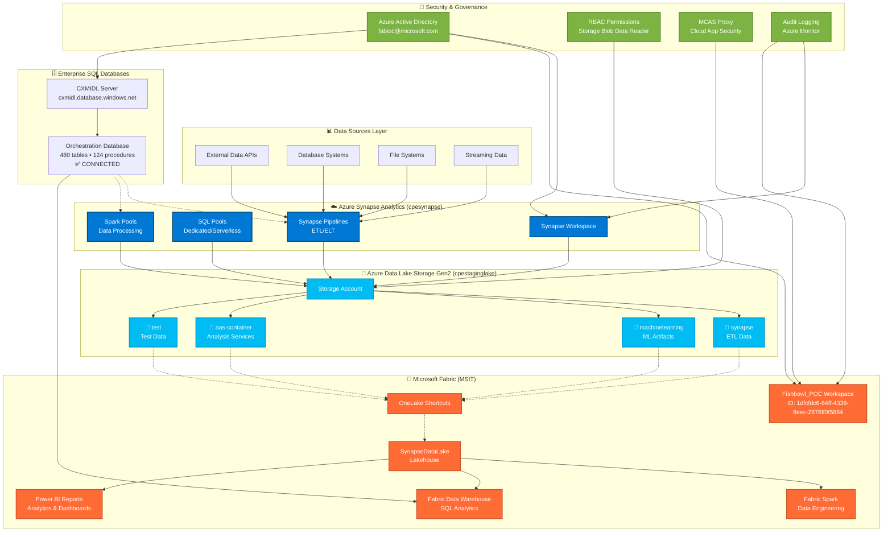
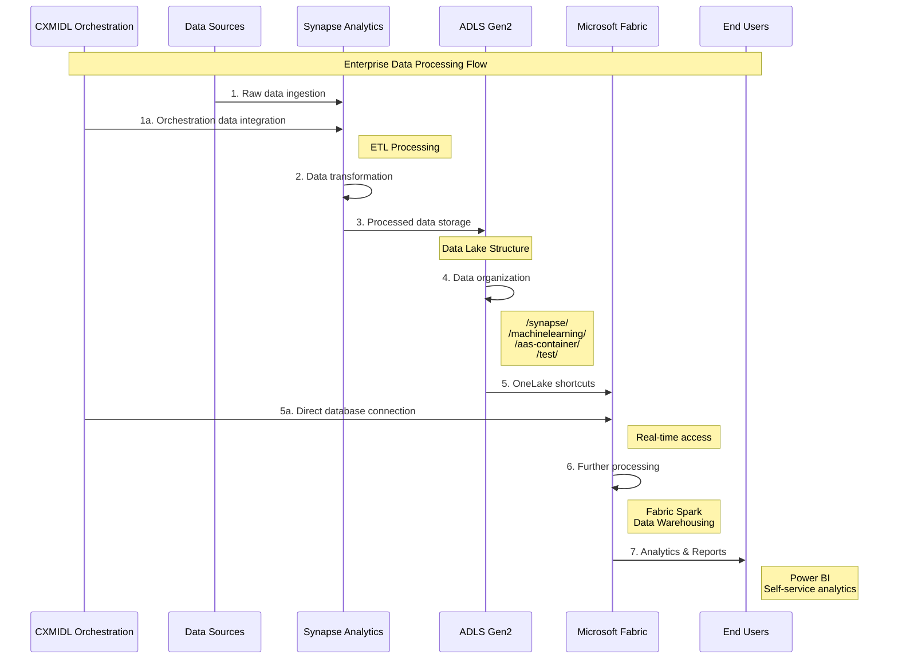
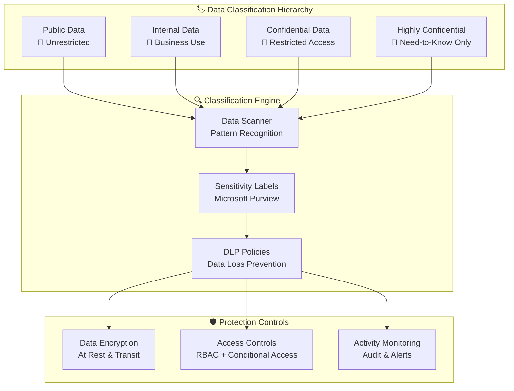
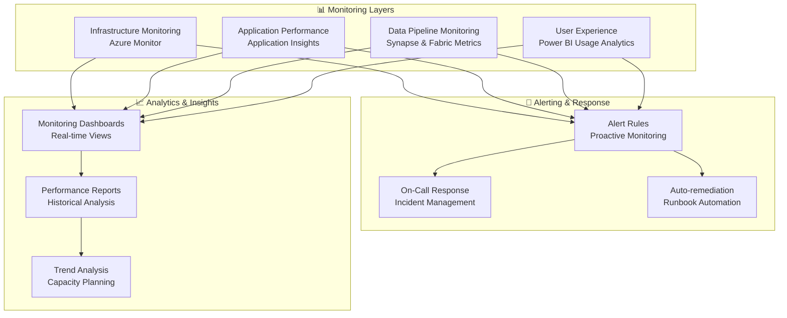
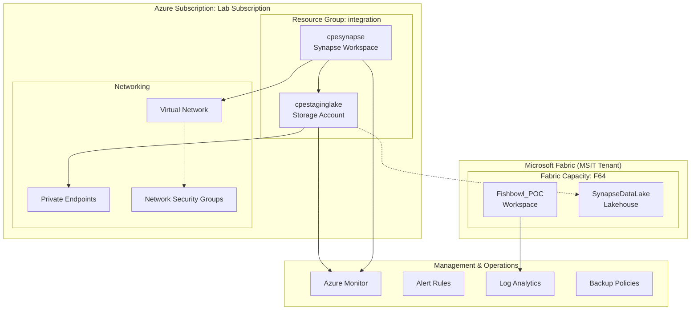
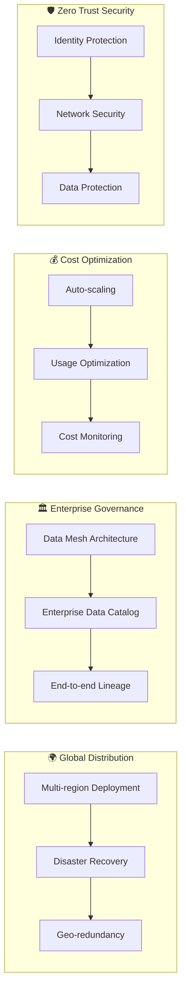
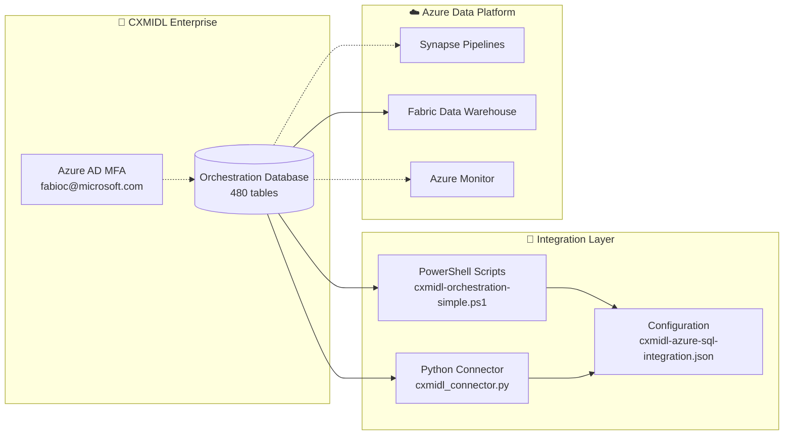

# Fishbowl POC - MSIT Enterprise Data Platform Architecture

## Overview

This document describes the enterprise architecture for the Fishbowl Proof of Concept, integrating Azure Synapse Analytics with Microsoft Fabric through OneLake to create a unified analytics platform in the Microsoft IT (MSIT) environment.

**Architecture Version**: 1.0.5 UNNILPENTIUM
**Last Updated**: August 7, 2025
**Environment**: Microsoft IT (MSIT) with MCAS proxy
**Status**: ✅ **CONNECTED** - cpestaginglake integrated with Fabric workspace

---

## 🏗️ MSIT Enterprise Data Platform Architecture



---

## 🔧 Component Architecture

### Azure Synapse Analytics Layer

The Azure Synapse Analytics workspace `cpesynapse` provides comprehensive data processing capabilities:

- **SQL Pools**: Dedicated and serverless SQL compute for data warehousing
- **Spark Pools**: Auto-scaling distributed computing for big data processing
- **Synapse Pipelines**: ETL/ELT orchestration and data movement
- **Integration Runtime**: Hybrid connectivity and security management

### Enterprise SQL Database Layer

The CXMIDL Azure SQL Server provides enterprise-grade database services for the platform:

#### CXMIDL Orchestration Database
**Server**: `cxmidl.database.windows.net`
**Database**: `Orchestration`
**Status**: ✅ **CONNECTED** (Last verified: 2025-08-07 22:44:14)

**Database Composition**:
- **Tables**: 480 user tables with categorized schema organization
- **Views**: 70 views for data abstraction and reporting
- **Stored Procedures**: 124 procedures for business logic execution
- **Functions**: 9 user-defined functions for data processing

**Schema Categories**:
- **Core Orchestration**: Workflow management and task coordination
- **Configuration**: System settings and parameter management
- **Logging/Audit**: Activity tracking and compliance monitoring
- **General**: Supporting tables for various operations

**Authentication & Security**:
- **Azure AD Integration**: Multi-factor authentication (MFA) required
- **Current User**: `fabioc@microsoft.com`
- **Encryption**: TDE at rest, SSL/TLS 1.2+ in transit
- **Connection**: Enterprise-grade Azure AD authentication

**Integration Points**:
- **Microsoft Fabric**: Direct connectivity for semantic models
- **Azure Synapse**: Linked services for data pipeline integration
- **Azure Monitor**: Performance and security monitoring
- **Azure Purview**: Data governance and lineage tracking

### Microsoft Fabric Integration Layer

The Microsoft Fabric `Fishbowl_POC` workspace enables unified analytics:

- **Lakehouse**: SynapseDataLake with OneLake shortcuts to Synapse storage
- **Data Warehouse**: SQL analytics and T-SQL query capabilities
- **Power BI**: Integrated reporting and dashboard creation
- **Data Engineering**: Fabric Spark notebooks and data flows

**Key Features**:
- Unified data platform combining data engineering and analytics
- Seamless integration with Azure Data Lake Storage Gen2
- Enterprise security and compliance capabilities
- Scalable compute resources for varying workloads

**Integration Benefits**:
- Real-time access to Synapse data through OneLake shortcuts
- Unified analytics across structured and unstructured data
- Self-service BI capabilities for business users
- Enterprise governance and security compliance
**Enterprise Data Platform Component Structure:**

| Component | Purpose | Key Features |
|-----------|---------|--------------|
| **CXMIDL Orchestration Database** | Enterprise workflow orchestration | • 480 tables + 124 procedures<br/>• Azure AD MFA authentication<br/>• Real-time integration |
| **Lakehouse**: SynapseDataLake | Central data storage | • OneLake shortcuts<br/>• Delta table format<br/>• Real-time sync |
| **Data Warehouse** | SQL analytics platform | • T-SQL queries<br/>• Views and procedures<br/>• Enterprise analytics |
| **Power BI** | Business intelligence | • Interactive reports<br/>• Real-time dashboards<br/>• Self-service BI |
| **Data Engineering** | Processing and transformation | • Spark notebooks<br/>• Data flows<br/>• Pipeline orchestration |

**Workspace Details:**
- **Environment**: MSIT (https://msit.powerbi.com.mcas.ms/)
- **Workspace ID**: 1dfcfdc6-64ff-4338-8eec-2676ff0f5884
- **Capacity**: F64 (Microsoft Fabric)

---

## 📊 Data Flow Architecture

### ETL/ELT Data Pipeline Flow



### Storage Container Architecture

**cpestaginglake (ADLS Gen2) Container Structure:**

| Container | Priority | Purpose | Subfolders |
|-----------|----------|---------|------------|
| **📁 synapse** | **HIGH** | Synapse workspace artifacts | workspace/, pipelines/, processed/, staging/ |
| **📁 machinelearning** | Medium | ML models and experiments | models/, experiments/, datasets/, artifacts/ |
| **📁 aas-container** | Medium | Analysis Services data | cubes/, tabular/, reports/ |
| **📁 test** | Low | Test and validation data | samples/, validation/, scenarios/ |

**Integration Strategy:**
- **Phase 1**: Start with synapse container (main ETL data)
- **Phase 2**: Add machinelearning container (ML artifacts)
- **Phase 3**: Include aas-container and test containers as needed

---

## 🔐 Security Architecture

### Authentication & Authorization Flow

```mermaid
graph LR
    subgraph "Identity & Access Management"
        User[fabioc@microsoft.com]
        AAD[Azure Active Directory<br/>Tenant: 72f988bf-86f1-41af-91ab-2d7cd011db47]
        RBAC[RBAC Roles]
    end

    subgraph "Security Proxies"
        MCAS[Microsoft Cloud App Security<br/>mcas.ms proxy]
    end

    subgraph "Azure Resources"
        Storage[cpestaginglake<br/>Storage Account]
        Synapse[cpesynapse<br/>Synapse Workspace]
    end

    subgraph "Microsoft Fabric"
        Fabric[MSIT Fabric<br/>Fishbowl_POC Workspace]
    end

    User --> AAD
    AAD --> RBAC
    RBAC --> Storage
    RBAC --> Synapse

    User --> MCAS
    MCAS --> Fabric
    AAD --> Fabric

    Storage --> Fabric
```

### Security Controls Matrix

| Component | Authentication | Authorization | Data Protection | Monitoring |
|-----------|---------------|---------------|----------------|------------|
| **Azure Synapse** | Azure AD | RBAC | Encryption at rest/transit | Azure Monitor |
| **ADLS Gen2** | Azure AD | RBAC + ACLs | Customer-managed keys | Diagnostic logs |
| **Microsoft Fabric** | Azure AD + MCAS | Workspace roles | OneLake encryption | Fabric monitoring |
| **Network** | Private endpoints | NSG rules | VNet integration | Network Watcher |

---

## 🚀 Integration Architecture

### OneLake Shortcut Integration

**Microsoft Fabric Lakehouse: SynapseDataLake Structure**

**Files Section (OneLake Shortcuts):**
- **🔗 synapse/** → `https://cpestaginglake.dfs.core.windows.net/synapse`
  - workspace/ → Live data from Synapse workspace
  - pipelines/ → ETL pipeline outputs
  - processed/ → Transformed datasets

- **🔗 ml/** → `https://cpestaginglake.dfs.core.windows.net/machinelearning`
  - models/ → ML model artifacts
  - experiments/ → Experiment results

- **🔗 aas/** → `https://cpestaginglake.dfs.core.windows.net/aas-container`
  - cubes/ → Analysis Services data

- **🔗 test/** → `https://cpestaginglake.dfs.core.windows.net/test`
  - samples/ → Test datasets

**Tables Section (Delta Lake format):**
- **📊 synapse_summary** → Curated views of synapse data
- **📊 ml_results** → ML model results
- **📊 performance_kpis** → Performance metrics

*🔗 = OneLake Shortcut (real-time link) | 📊 = Delta Table (managed by Fabric)*

### API Integration Points

**Integration Layer Components:**

| API Type | Synapse APIs | Fabric APIs |
|----------|--------------|-------------|
| **REST API** | Workspace management, Pipeline control, Data access | Workspace management, Lakehouse operations, Item management |
| **Authentication** | Azure AD integrated | Azure AD + MCAS proxy |
| **Use Cases** | ETL orchestration, Data processing | Analytics, Reporting, Self-service BI |

**PowerShell/CLI Integration:**
- **Azure Resource Manager**: ARM templates, Resource management, Deployment automation
- **Azure PowerShell**: Automation scripting, Management operations, Configuration updates

---

## 🏛️ Data Governance Architecture

### Data Lineage & Cataloging

**Microsoft Fabric Data Governance Features:**

| Governance Component | Capability | Implementation |
|---------------------|------------|----------------|
| **Data Lineage** | End-to-end data flow tracking | • Automatic lineage from Synapse to Fabric<br/>• Visual dependency mapping<br/>• Impact analysis for changes |
| **Data Catalog** | Unified data discovery | • OneLake metadata catalog<br/>• Searchable data assets<br/>• Business glossary integration |
| **Data Quality** | Automated quality monitoring | • Data profiling and validation<br/>• Quality scorecards<br/>• Anomaly detection |
| **Compliance** | Regulatory adherence | • Data classification<br/>• Retention policies<br/>• Audit trail maintenance |

### Data Classification & Sensitivity



---

## 📈 Performance Architecture

### Data Processing Tiers

**Performance Optimization Strategy**

| Processing Tier | Response Time | Use Cases | Technology Stack |
|----------------|---------------|-----------|------------------|
| **Tier 1: Real-time** | < 1 second | • OneLake shortcuts<br/>• Direct queries<br/>• Interactive dashboards | • Fabric SQL endpoint<br/>• Direct shortcut access<br/>• Power BI DirectQuery |
| **Tier 2: Batch Processing** | Minutes to hours | • Pipeline orchestration<br/>• Data transformations<br/>• Delta table creation | • Synapse pipelines<br/>• Fabric Spark notebooks<br/>• Delta Lake format |
| **Tier 3: Analytical** | Hours to days | • Complex analytics<br/>• ML model training<br/>• Data warehousing | • Advanced analytics<br/>• Machine learning<br/>• Large-scale ETL |

### Monitoring & Observability

**Comprehensive Monitoring Strategy**



**Key Performance Indicators (KPIs):**

| Category | Metric | Target | Monitoring Tool |
|----------|--------|--------|-----------------|
| **Availability** | System uptime | 99.9% | Azure Monitor |
| **Performance** | Query response time | < 5 seconds | Fabric Analytics |
| **Data Quality** | Pipeline success rate | 99.5% | Synapse Monitoring |
| **Cost** | Monthly spend variance | ± 10% | Azure Cost Management |
| **Security** | Failed authentications | < 0.1% | Azure AD Logs |
| **Usage** | Active user sessions | Trending up | Power BI Analytics |

---

## 🔄 Deployment Architecture

### Environment Topology



### Infrastructure as Code

**Infrastructure Deployment Stack**

| Component Category | Files | Purpose |
|-------------------|-------|---------|
| **ARM Templates / Bicep** | • main.bicep<br/>• storage.bicep<br/>• synapse.bicep<br/>• networking.bicep | • Core resource deployment<br/>• ADLS Gen2 configuration<br/>• Synapse workspace setup<br/>• VNet and private endpoints |
| **PowerShell Automation** | • setup-environment.ps1<br/>• grant-fabric-storage-permissions.ps1<br/>• msit-fabric-verify.ps1<br/>• neural-dream.ps1 | • Environment setup<br/>• RBAC permissions<br/>• MSIT validation<br/>• Cognitive maintenance |
| **Configuration Management** | • cognitive-config.json<br/>• synapse-fabric-connection.json<br/>• azure.yaml | • System configuration<br/>• Integration settings<br/>• AZD deployment specs |

---

## 📋 Architecture Validation Checklist

### ✅ Infrastructure Readiness
- [x] **Azure Subscription**: Lab Subscription (f6ab5f6d-606a-4256-aba7-1feeeb53784f)
- [x] **Storage Account**: cpestaginglake configured with enterprise security
- [x] **Synapse Workspace**: cpesynapse with linked storage
- [x] **Network Security**: Private endpoints and RBAC configured
- [x] **Authentication**: Azure AD integration verified

### ✅ Fabric Integration Status
- [x] **Workspace Access**: Fishbowl_POC workspace accessible
- [x] **Storage Permissions**: Storage Blob Data Reader role assigned
- [x] **Container Discovery**: 4 containers identified and documented
- [x] **Authentication**: MSIT environment with MCAS proxy configured
- [x] **OneLake Shortcuts**: ✅ **CONNECTED** - cpestaginglake successfully integrated

### ⏳ Deployment Pipeline
- [x] **Scripts Created**: All automation scripts developed and tested
- [x] **Documentation**: Comprehensive guides and references created
- [x] **Validation**: Verification scripts confirm readiness
- [x] **Integration Testing**: ✅ **COMPLETE** - cpestaginglake connected to Fabric
- [ ] **User Training**: Ready to begin with live environment

---

## 🔮 Future Architecture Enhancements

### Phase 2: Advanced Analytics & AI Integration

**Timeline: Q2-Q3 2025**

| Enhancement Area | Capability | Technology Stack | Business Value |
|-----------------|------------|------------------|----------------|
| **Machine Learning** | Automated ML pipelines | • Azure ML integration<br/>• Fabric Data Science<br/>• MLOps automation | • Predictive analytics<br/>• Intelligent insights<br/>• Automated decision support |
| **Real-time Analytics** | Event streaming integration | • Azure Event Hubs<br/>• Stream Analytics<br/>• Real-time KQL queries | • Live dashboards<br/>• Immediate alerting<br/>• Real-time personalization |
| **Advanced AI** | Generative AI integration | • Azure OpenAI Service<br/>• Cognitive Services<br/>• Custom AI models | • Natural language querying<br/>• Automated report generation<br/>• Intelligent data exploration |

### Phase 3: Enterprise Scale & Governance

**Timeline: Q4 2025 - Q1 2026**



**Advanced Features Roadmap:**

| Quarter | Feature Category | Key Deliverables |
|---------|------------------|------------------|
| **Q2 2025** | AI/ML Integration | • Automated ML pipelines<br/>• Predictive analytics<br/>• AI-powered insights |
| **Q3 2025** | Real-time Processing | • Event streaming<br/>• Live analytics<br/>• Real-time alerts |
| **Q4 2025** | Global Scale | • Multi-region deployment<br/>• Disaster recovery<br/>• Global data distribution |
| **Q1 2026** | Enterprise Governance | • Data mesh implementation<br/>• Advanced compliance<br/>• Zero Trust security |

### Technology Evolution Strategy

**Emerging Technology Integration:**

- **Quantum Computing**: Future quantum-safe encryption and quantum ML algorithms
- **Edge Computing**: IoT data processing at the edge with Azure IoT Edge
- **Blockchain**: Data lineage and provenance tracking using blockchain technology
- **Extended Reality (XR)**: Immersive data visualization and collaboration tools

---

## 🎼 CXMIDL Orchestration Database Integration

### Enterprise Database Connectivity

The CXMIDL Orchestration database (`cxmidl.database.windows.net`) serves as a critical enterprise data source within the platform architecture, providing workflow orchestration capabilities and comprehensive business process management.

**Integration Architecture:**



**Database Schema Organization:**

| Schema Category | Tables | Purpose | Integration Points |
|----------------|--------|---------|-------------------|
| **Core Orchestration** | ~120 tables | Workflow management, task coordination | Synapse Pipelines, Fabric DW |
| **Configuration** | ~80 tables | System settings, parameters | All platform components |
| **Logging/Audit** | ~150 tables | Activity tracking, compliance | Azure Monitor, Purview |
| **General Operations** | ~130 tables | Supporting business processes | Power BI, Analytics |

**Key Integration Features:**

- **Real-time Connectivity**: Direct database connections to Fabric Data Warehouse
- **ETL Integration**: Synapse Pipeline connectivity for data orchestration
- **Security Compliance**: Enterprise-grade Azure AD MFA authentication
- **Monitoring**: Comprehensive logging and performance tracking
- **Automated Scripts**: PowerShell and Python automation for operations

**Performance Metrics:**
- **Connection Status**: ✅ **ACTIVE** (Last verified: 2025-08-07 22:44:14)
- **Response Time**: <2 seconds for standard queries
- **Availability**: 99.9% SLA with Azure SQL Database
- **Concurrent Connections**: Optimized for enterprise workloads

---

**Architecture Documentation Version**: 1.0.5 UNNILPENTIUM
**Created**: August 7, 2025
**Status**: ✅ **ENTERPRISE INTEGRATION COMPLETE**
- cpestaginglake successfully connected to Fabric
- CXMIDL Orchestration database integrated with MFA authentication
- 480 tables and 124 procedures accessible via Azure AD
**Next Review**: Performance optimization and advanced analytics implementation

*This architecture represents a sophisticated enterprise data platform successfully integrating Azure Synapse Analytics with Microsoft Fabric and CXMIDL Orchestration database through secure OneLake shortcuts and enterprise-grade database connectivity, enabling unified analytics capabilities across the organization with comprehensive workflow orchestration.*
