# Microsoft Fabric Learning Lessons

Welcome to your Microsoft Fabric learning journey! This comprehensive guide takes you from beginner to advanced practitioner through hands-on lessons designed to build real-world expertise.

## 🎯 Learning Architecture Overview

```mermaid
graph TD
    A[🚀 Start Your Journey] --> B[📁 Lesson 1: OneLake Basics]
    B --> C[🔺 Lesson 2: Delta Tables]
    C --> D[🔍 Lesson 3: SQL Analytics]
    D --> E[⚙️ Lesson 4: Data Pipelines]
    E --> F[📊 Lesson 5: Power BI Reports]
    F --> G[⚡ Lesson 6: Real-time Streams]
    G --> H[🎓 Fabric Expert!]

    subgraph Foundation["🏗️ Foundation Phase"]
        B
        C
    end

    subgraph Development["⚙️ Development Phase"]
        D
        E
    end

    subgraph Advanced["🚀 Advanced Phase"]
        F
        G
    end

    style A fill:#e1f5fe,stroke:#01579b,stroke-width:3px
    style B fill:#f3e5f5,stroke:#4a148c,stroke-width:2px
    style C fill:#e8f5e8,stroke:#1b5e20,stroke-width:2px
    style D fill:#fff3e0,stroke:#e65100,stroke-width:2px
    style E fill:#fce4ec,stroke:#880e4f,stroke-width:2px
    style F fill:#e0f2f1,stroke:#004d40,stroke-width:2px
    style G fill:#f1f8e9,stroke:#33691e,stroke-width:2px
    style H fill:#ffebee,stroke:#b71c1c,stroke-width:3px
    style Foundation fill:#f8f9fa,stroke:#6c757d,stroke-width:2px
    style Development fill:#f8f9fa,stroke:#6c757d,stroke-width:2px
    style Advanced fill:#f8f9fa,stroke:#6c757d,stroke-width:2px
```



## 🧠 Knowledge Architecture


## 📚 Lesson Overview

### 🏗️ Foundation Phase (Build Your Base)
Learn the fundamental concepts and get comfortable with the Fabric environment.
- **Lesson 1**: Getting Started with OneLake - Your data storage foundation
- **Lesson 2**: Understanding Delta Tables - Modern data architecture

### 🔧 Development Phase (Build Your Skills)
Develop practical data engineering and analytics capabilities.
- **Lesson 3**: SQL Analytics and Queries - Query and analyze your data
- **Lesson 4**: Data Pipelines and ETL - Automate data transformations

### 🚀 Advanced Phase (Build Your Solutions)
Create production-ready analytics solutions and real-time systems.
- **Lesson 5**: Power BI Integration - Build interactive dashboards
- **Lesson 6**: Real-time Analytics with EventStreams - Process streaming data

---

## 📖 Lesson Details & Progress Tracking

### Lesson 1: Getting Started with OneLake
**Duration**: 30 minutes
**Objective**: Upload sample data and explore OneLake interface
**Prerequisites**: None

#### 🎯 Lesson Introduction
OneLake is Microsoft Fabric's unified data lake that serves as the foundation for all analytics workloads in your organization. Unlike traditional data lakes that require complex setup and management, OneLake provides a single, automatically managed storage layer that works seamlessly with all Fabric services.

**Why OneLake Matters:**
- **Universal Access**: All data is accessible to every analytics service in Fabric without data movement
- **Open Standards**: Built on Delta Lake format, ensuring compatibility and vendor independence
- **Zero-ETL Architecture**: Eliminates the need for complex data pipelines between storage and compute
- **Enterprise Security**: Comprehensive governance, encryption, and access controls built-in

In this foundational lesson, you'll experience the simplicity and power of OneLake firsthand. You'll upload your first datasets and explore how Fabric's unified approach eliminates the traditional complexity of data lake management. This is your gateway into the modern analytics platform.

#### 📊 Lesson 1 Workflow

```mermaid
flowchart TD
    A[🚀 Start Lesson 1] --> B[📁 Access Fabric Workspace]
    B --> C[📂 Navigate to OneLake]
    C --> D[📄 Upload products.csv]
    D --> E[📄 Upload customers.csv]
    E --> F[🔍 Explore File Structure]
    F --> G[📋 Verify Data Upload]
    G --> H[✅ Lesson Complete!]

    subgraph "Data Files"
        I[products.csv<br/>📦 10 products<br/>🏷️ 4 categories]
        J[customers.csv<br/>👥 8 customers<br/>🌍 4 countries]
    end

    D -.-> I
    E -.-> J

    style A fill:#e3f2fd,stroke:#1976d2,stroke-width:3px
    style H fill:#e8f5e8,stroke:#388e3c,stroke-width:3px
    style I fill:#fff3e0,stroke:#f57c00,stroke-width:2px
    style J fill:#f3e5f5,stroke:#7b1fa2,stroke-width:2px
```



#### 🎯 Learning Objectives
By the end of this lesson, you will:

**🔧 Technical Skills:**
- **Navigate** the Fabric workspace interface with confidence and efficiency
- **Upload** data files to OneLake storage using multiple methods (drag-drop, browse, bulk upload)
- **Understand** OneLake's hierarchical organization structure (Workspaces → Items → Files)
- **Explore** the integrated file browser, metadata viewer, and data preview capabilities

**🧠 Conceptual Understanding:**
- **Grasp** the OneLake architecture and how it differs from traditional data lakes
- **Recognize** the benefits of unified storage across all analytics workloads
- **Appreciate** the automatic format optimization and governance features
- **Identify** when and why to use OneLake in enterprise scenarios

**💼 Business Impact:**
- **Evaluate** how OneLake simplifies data architecture decisions
- **Articulate** the cost and complexity benefits to stakeholders
- **Plan** data organization strategies for your organization's analytics needs

**Key Activities**:
- [ ] Upload `products.csv` to OneLake
- [ ] Upload `customers.csv` to OneLake
- [ ] Explore the OneLake file browser
- [ ] Understand file organization

**Success Criteria**:
- ✅ Both CSV files visible in OneLake
- ✅ Can navigate OneLake interface confidently

**Quick Start Command**:
```powershell
# Navigate to your workspace
Start-Process "https://app.fabric.microsoft.com"
```

---

### Lesson 2: Understanding Delta Tables
**Duration**: 45 minutes
**Objective**: Convert CSV files to Delta format and understand benefits
**Prerequisites**: Lesson 1 completed

#### 🎯 Lesson Introduction
Delta Lake represents a paradigm shift in data lake architecture, transforming simple file storage into a powerful, enterprise-grade data management platform. While traditional data lakes suffer from consistency issues, poor performance, and schema chaos, Delta Lake brings database-like reliability to the scale and flexibility of data lakes.

**The Delta Lake Revolution:**
- **ACID Transactions**: Ensures data consistency even with concurrent reads and writes
- **Schema Evolution**: Automatically handles changing data structures without breaking existing queries
- **Time Travel**: Query any version of your data, enabling auditing, rollbacks, and historical analysis
- **Performance Optimization**: Automatic file compaction, indexing, and caching for lightning-fast queries
- **Unified Batch & Streaming**: Seamlessly handles both real-time and batch data processing

**Real-World Impact:**
Consider a traditional analytics scenario where CSV files become corrupted during updates, or where schema changes break downstream applications. Delta Lake eliminates these risks while dramatically improving query performance. You'll witness this transformation firsthand as you convert your sample data from fragile CSV files into robust Delta tables.

This lesson is where you transition from basic file storage to enterprise-grade data architecture. You'll not only learn the technical steps but understand why Delta Lake has become the industry standard for modern data platforms.

#### 🔺 Lesson 2 Workflow

```mermaid
flowchart TD
    A[📄 CSV Files in OneLake] --> B[🔧 Create Delta Table Schema]
    B --> C[🔺 Convert products.csv → Delta]
    C --> D[🔺 Convert customers.csv → Delta]
    D --> E[⚡ Test ACID Properties]
    E --> F[🕐 Explore Time Travel]
    F --> G[📊 Compare Performance]
    G --> H[✅ Delta Mastery!]

    subgraph "Delta Benefits"
        I[⚡ Performance<br/>🔒 ACID Transactions<br/>🕐 Time Travel<br/>📋 Schema Evolution]
    end

    subgraph "Data Transformation"
        J[products.csv] --> K[products_delta]
        L[customers.csv] --> M[customers_delta]
    end

    C -.-> J
    C -.-> K
    D -.-> L
    D -.-> M
    E -.-> I

    style A fill:#fff3e0,stroke:#f57c00,stroke-width:2px
    style H fill:#e8f5e8,stroke:#388e3c,stroke-width:3px
    style I fill:#e1f5fe,stroke:#0277bd,stroke-width:2px
    style K fill:#f3e5f5,stroke:#7b1fa2,stroke-width:2px
    style M fill:#f3e5f5,stroke:#7b1fa2,stroke-width:2px
```



#### 🎯 Learning Objectives
By the end of this lesson, you will:

**🔧 Technical Mastery:**
- **Understand** Delta Lake architecture, internals, and how it enhances traditional data lakes
- **Create** optimized Delta tables from CSV data using best practices
- **Experience** ACID transaction guarantees through hands-on concurrent operations
- **Master** time travel queries to access historical data versions and audit changes
- **Compare** Delta vs CSV performance characteristics with real benchmarks

**🧠 Architectural Understanding:**
- **Analyze** the transaction log mechanism that enables ACID properties
- **Evaluate** schema evolution strategies for handling changing data requirements
- **Recognize** optimization opportunities (partitioning, Z-ordering, compaction)
- **Assess** when to use Delta Lake vs other storage formats in enterprise scenarios

**💡 Strategic Insights:**
- **Quantify** the performance improvements and reliability benefits
- **Plan** migration strategies from legacy data formats to Delta Lake
- **Design** data governance policies leveraging Delta Lake features
- **Communicate** business value to stakeholders through concrete examples

**Key Activities**:
- [ ] Create Delta table from products.csv
- [ ] Create Delta table from customers.csv
- [ ] Explore Delta table properties
- [ ] Compare CSV vs Delta performance

**Success Criteria**:
- ✅ Two Delta tables created and accessible
- ✅ Understanding of Delta format advantages

**Sample Code**:
```sql
-- Products Delta Table Creation
CREATE TABLE products_delta
USING DELTA
LOCATION 'Tables/products_delta'
AS SELECT * FROM products_csv;
```

---

### Lesson 3: SQL Analytics and Queries
**Duration**: 60 minutes
**Objective**: Master SQL querying in Fabric environment
**Prerequisites**: Lesson 2 completed

#### 🎯 Lesson Introduction
SQL in Microsoft Fabric represents the convergence of traditional database analytics with modern data lake scale and flexibility. Unlike traditional SQL environments limited by single-server constraints, Fabric's SQL engine harnesses distributed computing power while maintaining the familiar SQL syntax that analysts and data professionals know and love.

**Fabric SQL Superpowers:**
- **Unified Analytics**: Query data across OneLake, Warehouses, and Lakehouses with a single SQL dialect
- **Massive Scale**: Process petabytes of data with automatic parallelization and optimization
- **Real-time & Historical**: Seamlessly query both streaming and batch data sources
- **Advanced Functions**: Access cutting-edge analytical functions including ML, geospatial, and time-series
- **Performance Optimization**: Automatic query optimization, caching, and result acceleration

**Your Analytics Journey:**
This lesson transforms you from a basic SQL user into a sophisticated data analyst. You'll progress from simple SELECT statements to complex analytical queries that reveal hidden business insights. Using your products and customers data, you'll discover patterns, trends, and relationships that drive real business decisions.

**What Makes This Different:**
Traditional SQL tutorials use toy datasets with obvious patterns. Here, you'll work with realistic business data, learning to ask the right questions and interpret results in business context. You'll master not just SQL syntax, but analytical thinking—the difference between knowing SQL and being a data analyst.

#### 🔍 Lesson 3 Workflow

```mermaid
flowchart TD
    A[🔺 Delta Tables Ready] --> B[📝 Basic SELECT Queries]
    B --> C[🔗 JOIN Operations]
    C --> D[📊 Aggregation & Grouping]
    D --> E[🧮 Window Functions]
    E --> F[📈 Advanced Analytics]
    F --> G[⚡ Query Optimization]
    G --> H[✅ SQL Expert!]

    subgraph "Query Types"
        I[🔍 Data Exploration<br/>🔗 Cross-table Joins<br/>📊 Business Metrics<br/>📈 Trend Analysis]
    end

    subgraph "Data Sources"
        J[products_delta<br/>📦 Product Catalog]
        K[customers_delta<br/>👥 Customer Base]
    end

    C -.-> J
    C -.-> K
    D -.-> I
    E -.-> I
    F -.-> I

    style A fill:#f3e5f5,stroke:#7b1fa2,stroke-width:2px
    style H fill:#e8f5e8,stroke:#388e3c,stroke-width:3px
    style I fill:#fff3e0,stroke:#f57c00,stroke-width:2px
    style J fill:#e1f5fe,stroke:#0277bd,stroke-width:2px
    style K fill:#e1f5fe,stroke:#0277bd,stroke-width:2px
```



#### 🎯 Learning Objectives
By the end of this lesson, you will:

**🔧 SQL Mastery:**
- **Master** fundamental and advanced SQL syntax specific to Fabric's analytics engine
- **Join** data from multiple Delta tables effectively using various join strategies (INNER, LEFT, FULL, CROSS)
- **Create** complex aggregations and business metrics using GROUP BY, HAVING, and analytical functions
- **Apply** window functions for advanced analytics including ranking, running totals, and moving averages
- **Optimize** query performance using indexing strategies, query hints, and execution plan analysis

**📊 Analytical Thinking:**
- **Formulate** business questions that can be answered through data analysis
- **Design** multi-step analytical workflows that build insights progressively
- **Interpret** query results in business context and communicate findings effectively
- **Validate** data quality and identify anomalies through exploratory queries

**🎯 Business Intelligence:**
- **Calculate** key performance indicators (KPIs) and business metrics
- **Identify** trends, patterns, and correlations in customer and product data
- **Segment** customers and products for targeted business strategies
- **Generate** actionable insights that drive business decision-making
- **Optimize** query performance in Fabric

**Key Activities**:
- [ ] Basic SELECT queries on Delta tables
- [ ] JOIN operations between products and customers
- [ ] Aggregation and grouping queries
- [ ] Advanced analytics functions

**Success Criteria**:
- ✅ Can write complex SQL queries
- ✅ Understand Fabric SQL capabilities

**Practice Queries**:
```sql
-- Customer analysis by country
SELECT country, COUNT(*) as customer_count,
       AVG(CAST(annual_revenue as DECIMAL(15,2))) as avg_revenue
FROM customers_delta
GROUP BY country
ORDER BY avg_revenue DESC;
```

---

### Lesson 4: Data Pipelines and ETL
**Duration**: 75 minutes
**Objective**: Build automated data transformation pipelines
**Prerequisites**: Lesson 3 completed

#### 🎯 Lesson Introduction
Data pipelines represent the circulatory system of modern data platforms—they keep information flowing, clean, and available when and where it's needed. In enterprise environments, manual data processing doesn't scale. You need automated, reliable, and monitorable systems that can handle growing data volumes while maintaining quality and performance.

**The Pipeline Paradigm:**
- **Automation First**: Eliminate manual data processing that's error-prone and time-consuming
- **Quality Assurance**: Build validation and cleansing logic that ensures data reliability
- **Scalable Architecture**: Design systems that grow with your data volumes and complexity
- **Fault Tolerance**: Create robust pipelines that handle failures gracefully and resume operations
- **Observability**: Implement comprehensive monitoring and alerting for operational excellence

**Real-World Engineering:**
This isn't about academic ETL concepts—you're building production-ready data infrastructure. You'll experience the challenges real data engineers face: handling schema changes, dealing with data quality issues, optimizing performance, and ensuring reliability. You'll learn to think like a systems engineer, not just a data user.

**Your Engineering Evolution:**
By the end of this lesson, you'll understand why companies invest heavily in data engineering teams. You'll appreciate the complexity hidden behind "simple" data transformations and gain the skills to build enterprise-grade data infrastructure that supports critical business operations.

#### ⚙️ Lesson 4 Workflow

```mermaid
flowchart TD
    A[🔍 Analyze Data Requirements] --> B[🏗️ Design Pipeline Architecture]
    B --> C[📥 Configure Data Sources]
    C --> D[🔧 Create Transformation Logic]
    D --> E[📤 Set Output Destinations]
    E --> F[⏰ Schedule Automation]
    F --> G[📊 Add Monitoring & Alerts]
    G --> H[🚀 Deploy Pipeline]
    H --> I[✅ ETL Expert!]

    subgraph "Pipeline Components"
        J[📥 Data Ingestion<br/>🔧 Data Transformation<br/>📤 Data Loading<br/>📊 Quality Monitoring]
    end

    subgraph "Data Flow"
        K[Raw CSV Files] --> L[Cleansed Data]
        L --> M[Enriched Data]
        M --> N[Analytics-Ready Tables]
    end

    C -.-> K
    D -.-> L
    D -.-> M
    E -.-> N
    F -.-> J
    G -.-> J

    style A fill:#fff3e0,stroke:#f57c00,stroke-width:2px
    style I fill:#e8f5e8,stroke:#388e3c,stroke-width:3px
    style J fill:#e1f5fe,stroke:#0277bd,stroke-width:2px
    style N fill:#f3e5f5,stroke:#7b1fa2,stroke-width:2px
```



#### 🎯 Learning Objectives
By the end of this lesson, you will:

**🏗️ Architecture & Design:**
- **Design** scalable ETL pipeline architectures that handle enterprise data volumes
- **Create** automated data transformation workflows using Fabric Data Factory
- **Implement** comprehensive data quality checks, validation rules, and error handling mechanisms
- **Plan** for pipeline scalability, maintainability, and operational efficiency

**⚙️ Technical Implementation:**
- **Build** end-to-end data pipelines from source ingestion to destination loading
- **Configure** various data sources (files, databases, APIs) and transformation activities
- **Schedule** and orchestrate complex multi-step data processing workflows
- **Monitor** pipeline execution, performance metrics, and resource utilization

**🔧 Operational Excellence:**
- **Troubleshoot** common pipeline issues including data quality problems and performance bottlenecks
- **Optimize** pipeline performance through parallelization, caching, and resource management
- **Implement** robust error handling, retry logic, and failure recovery mechanisms
- **Establish** monitoring, alerting, and operational procedures for production environments

**💼 Business Impact:**
- **Quantify** the business value of automated data processing vs manual operations
- **Design** data pipelines that support real-time business decision-making
- **Plan** migration strategies from legacy ETL systems to modern cloud-native solutions

**Key Activities**:
- [ ] Create Data Factory pipeline
- [ ] Set up data transformation activities
- [ ] Schedule pipeline execution
- [ ] Monitor pipeline performance

**Success Criteria**:
- ✅ Working ETL pipeline created
- ✅ Data automatically processed and transformed

**Pipeline Components**:
- Data source: OneLake files
- Transformation: Data flow activities
- Destination: Delta tables
- Schedule: Daily at 6 AM

---

### Lesson 5: Power BI Integration
**Duration**: 90 minutes
**Objective**: Create interactive reports and dashboards
**Prerequisites**: Lesson 4 completed

#### 🎯 Lesson Introduction
Power BI represents the democratization of business intelligence—transforming complex data analysis from a specialized skill into an accessible tool for every business professional. In Microsoft Fabric, Power BI becomes even more powerful, with seamless integration to your data lake and real-time connectivity to all your analytics workloads.

**The Visualization Revolution:**
- **Self-Service Analytics**: Empower business users to create their own reports without IT dependency
- **Interactive Storytelling**: Transform static reports into dynamic, exploratory experiences
- **Real-Time Insights**: Connect directly to live data sources for up-to-the-minute business intelligence
- **Collaborative Intelligence**: Share insights across organizations and enable data-driven conversations
- **Mobile-First Design**: Ensure your dashboards work perfectly on any device, anywhere

**Beyond Pretty Charts:**
This lesson goes far beyond creating attractive visualizations. You'll learn the psychology of data presentation—how colors, layouts, and interaction patterns influence decision-making. You'll understand when to use different chart types, how to design for your audience, and how to create reports that actually drive business action.

**Your BI Transformation:**
You'll evolve from someone who consumes reports to someone who creates compelling data stories. You'll learn to think like a designer, considering user experience, cognitive load, and visual hierarchy. Most importantly, you'll understand how to translate complex analytical insights into clear, actionable business intelligence.

#### 📊 Lesson 5 Workflow

```mermaid
flowchart TD
    A[🔺 Delta Tables Ready] --> B[🔌 Connect Power BI to Fabric]
    B --> C[📊 Design Data Model]
    C --> D[📈 Create Visualizations]
    D --> E[🎨 Build Dashboard Layout]
    E --> F[🔍 Add Interactivity]
    F --> G[🚀 Publish & Share]
    G --> H[👥 Collaborate with Team]
    H --> I[✅ BI Expert!]

    subgraph "Report Types"
        J[📊 Product Analysis<br/>🌍 Customer Geography<br/>📈 Revenue Trends<br/>🎯 KPI Dashboards]
    end

    subgraph "Visualization Gallery"
        K[📊 Bar Charts<br/>🗺️ Maps<br/>📈 Line Graphs<br/>🎯 KPI Cards<br/>📋 Tables]
    end

    D -.-> J
    D -.-> K
    E -.-> J
    F -.-> K

    style A fill:#f3e5f5,stroke:#7b1fa2,stroke-width:2px
    style I fill:#e8f5e8,stroke:#388e3c,stroke-width:3px
    style J fill:#fff3e0,stroke:#f57c00,stroke-width:2px
    style K fill:#e1f5fe,stroke:#0277bd,stroke-width:2px
```



#### 🎯 Learning Objectives
By the end of this lesson, you will:

**🎨 Visualization Design:**
- **Connect** Power BI to Fabric data sources seamlessly using DirectQuery and Import modes
- **Design** effective data models with proper relationships, hierarchies, and calculated fields
- **Create** compelling visualizations that communicate insights clearly and drive action
- **Master** advanced chart types, custom visuals, and interactive elements for rich user experiences

**📊 Dashboard Development:**
- **Build** interactive dashboards with drill-down capabilities, filtering, and cross-visual interactions
- **Implement** responsive design principles that work across desktop, tablet, and mobile devices
- **Configure** bookmarks, buttons, and navigation elements for intuitive user journeys
- **Optimize** report performance through efficient data modeling and query optimization

**👥 Collaboration & Sharing:**
- **Share** reports and collaborate with stakeholders using Fabric workspace permissions
- **Configure** row-level security to ensure users see only appropriate data
- **Set up** automated data refresh schedules and email subscriptions for stakeholders
- **Create** compelling presentations and storytelling experiences using Power BI's narrative features

**💡 Strategic Impact:**
- **Measure** business impact through usage analytics and user feedback
- **Design** KPI dashboards that align with organizational objectives and OKRs
- **Establish** governance practices for report standards, naming conventions, and data accuracy

**Key Activities**:
- [ ] Connect Power BI to Delta tables
- [ ] Create product category analysis report
- [ ] Build customer geography dashboard
- [ ] Share reports with stakeholders

**Success Criteria**:
- ✅ Interactive Power BI reports created
- ✅ Dashboard published and accessible

**Report Ideas**:
- Product sales by category
- Customer distribution map
- Revenue trends over time
- Top performing regions

---

### Lesson 6: Real-time Analytics with EventStreams
**Duration**: 60 minutes
**Objective**: Process streaming data for real-time insights
**Prerequisites**: Lesson 5 completed

#### 🎯 Lesson Introduction
Real-time analytics represents the pinnacle of modern data engineering—the ability to process, analyze, and act on data as it streams into your system. This capability separates good analytics platforms from transformational ones. In today's fast-paced business environment, the difference between real-time insights and delayed batch processing can mean the difference between capturing opportunities and missing them.

**The Real-Time Advantage:**
- **Immediate Response**: React to business events as they happen, not hours or days later
- **Competitive Edge**: Make decisions based on current reality, not historical snapshots
- **Operational Excellence**: Monitor systems and processes in real-time to prevent issues before they impact business
- **Customer Experience**: Personalize interactions based on live behavior and preferences
- **Risk Management**: Detect anomalies, fraud, and security threats the moment they occur

**Technical Mastery:**
EventStreams in Fabric provide enterprise-grade stream processing without the complexity of traditional streaming platforms. You'll learn to handle the unique challenges of streaming data: dealing with late arrivals, managing watermarks, handling backpressure, and ensuring exactly-once processing semantics.

**Your Final Transformation:**
This lesson completes your journey from data consumer to full-stack data professional. You'll possess skills spanning storage (OneLake), processing (Delta Lake), analytics (SQL), automation (Pipelines), visualization (Power BI), and now real-time processing (EventStreams). You'll understand the entire modern data stack and how each component contributes to enterprise analytics success.

#### ⚡ Lesson 6 Workflow

```mermaid
flowchart TD
    A[📡 Real-time Data Sources] --> B[🌊 Create EventStream]
    B --> C[🔧 Configure Stream Processing]
    C --> D[🔄 Add Transformations]
    D --> E[📊 Build Live Dashboard]
    E --> F[🚨 Set Up Alerts]
    F --> G[📈 Monitor Performance]
    G --> H[🎯 Optimize Streaming]
    H --> I[✅ Real-time Expert!]

    subgraph "Data Sources"
        J[📦 Order Events<br/>👥 User Activity<br/>📊 System Metrics<br/>🌐 IoT Sensors]
    end

    subgraph "Stream Processing"
        K[🔄 Real-time ETL<br/>📊 Aggregations<br/>🔍 Filtering<br/>🧮 Calculations]
    end

    subgraph "Outputs"
        L[📊 Live Dashboards<br/>🚨 Real-time Alerts<br/>📋 Streaming Tables<br/>📈 KPI Monitors]
    end

    A -.-> J
    C -.-> K
    D -.-> K
    E -.-> L
    F -.-> L

    style A fill:#fff3e0,stroke:#f57c00,stroke-width:2px
    style I fill:#e8f5e8,stroke:#388e3c,stroke-width:3px
    style K fill:#e1f5fe,stroke:#0277bd,stroke-width:2px
    style L fill:#f3e5f5,stroke:#7b1fa2,stroke-width:2px
```



#### 🎯 Learning Objectives
By the end of this lesson, you will:

**🌊 Stream Processing Mastery:**
- **Create** and configure EventStreams for processing real-time data from various sources
- **Design** streaming transformations including filtering, aggregations, and enrichment operations
- **Implement** windowing functions for time-based analytics (tumbling, sliding, session windows)
- **Handle** late-arriving data, out-of-order events, and streaming data quality challenges

**📊 Real-Time Analytics:**
- **Build** live dashboards that update in real-time with streaming data insights
- **Configure** streaming aggregations for continuous calculation of business metrics
- **Implement** complex event processing patterns for detecting business-critical scenarios
- **Optimize** streaming query performance and resource utilization for cost-effectiveness

**🚨 Operational Excellence:**
- **Set up** automated alerts and notifications based on streaming data patterns and thresholds
- **Monitor** streaming pipeline health, throughput, and latency using Fabric's observability tools
- **Implement** error handling, dead letter queues, and replay mechanisms for production reliability
- **Design** scaling strategies for handling variable data volumes and velocity

**🎯 Strategic Implementation:**
- **Evaluate** use cases where real-time processing provides competitive advantage over batch analytics
- **Architect** hybrid solutions combining streaming and batch processing for optimal business outcomes
- **Plan** migration strategies from traditional batch-oriented analytics to real-time architectures
- **Quantify** business impact of real-time insights vs traditional delayed reporting

**Key Activities**:
- [ ] Create EventStream for real-time data
- [ ] Set up streaming transformations
- [ ] Build real-time dashboard
- [ ] Configure alerts and notifications

**Success Criteria**:
- ✅ Real-time data pipeline operational
- ✅ Live dashboard showing streaming metrics

**EventStream Sources**:
- Sample: Order processing events
- Customer activity streams
- Product inventory updates

---

## 🎯 Learning Path Recommendations


### 🎓 Learning Paths by Experience Level

```mermaid
flowchart LR
    A[🚀 Choose Your Path] --> B[🌱 Beginner<br/>4 weeks]
    A --> C[⚡ Accelerated<br/>4 days]
    A --> D[🎯 Role-Focused<br/>Custom]

    B --> E[Week 1: Foundation<br/>📁 OneLake + 🔺 Delta]
    E --> F[Week 2: Analytics<br/>🔍 SQL Mastery]
    F --> G[Week 3: Engineering<br/>⚙️ Pipelines + 📊 Power BI]
    G --> H[Week 4: Advanced<br/>⚡ Real-time Analytics]

    C --> I[Day 1: Foundation<br/>Lessons 1-2]
    I --> J[Day 2: Analytics<br/>Lesson 3]
    J --> K[Day 3: Engineering<br/>Lesson 4]
    K --> L[Day 4: Advanced<br/>Lessons 5-6]

    D --> M[👨‍💻 Data Engineer<br/>Focus: 2,4,6]
    D --> N[📊 Data Analyst<br/>Focus: 3,5]
    D --> O[💼 Business User<br/>Focus: 1,3,5]

    style A fill:#e1f5fe,stroke:#01579b,stroke-width:3px
    style B fill:#e8f5e8,stroke:#2e7d32,stroke-width:2px
    style C fill:#fff3e0,stroke:#f57c00,stroke-width:2px
    style D fill:#f3e5f5,stroke:#7b1fa2,stroke-width:2px
```



### Beginner Path (Start Here)
1. **Week 1**: Lessons 1-2 (Foundation)
2. **Week 2**: Lesson 3 (SQL Skills)
3. **Week 3**: Lessons 4-5 (Pipeline & Visualization)
4. **Week 4**: Lesson 6 (Advanced Streaming)

### Accelerated Path (Experienced Users)
1. **Day 1**: Lessons 1-2
2. **Day 2**: Lesson 3
3. **Day 3**: Lesson 4
4. **Day 4**: Lessons 5-6

### Focus Areas by Role
**Data Engineer**: Emphasize Lessons 2, 4, 6
**Data Analyst**: Focus on Lessons 3, 5
**Business User**: Prioritize Lessons 1, 3, 5

---

## 🛠️ Quick Reference Commands

### Access Your Environment
```powershell
# Open Fabric workspace
Start-Process "https://app.fabric.microsoft.com"

# Test connections
.\scripts\synapse-onelake-connector.ps1 -Operation test

# Check environment status
.\scripts\synapse-onelake-connector.ps1 -Operation connect
```

### File Locations
- **Sample Data**: `sample-data/products.csv`, `sample-data/customers.csv`
- **Detailed Guide**: `FABRIC-LEARNING-GUIDE.md`
- **Setup Documentation**: `SETUP-COMPLETE.md`
- **Quick Commands**: `QUICK-REFERENCE.md`

---

## 📊 Progress Tracking

Track your completion status:

| Lesson | Status | Date Completed | Notes |
|--------|--------|----------------|--------|
| Lesson 1 | ⏳ Not Started | | |
| Lesson 2 | ⏳ Not Started | | |
| Lesson 3 | ⏳ Not Started | | |
| Lesson 4 | ⏳ Not Started | | |
| Lesson 5 | ⏳ Not Started | | |
| Lesson 6 | ⏳ Not Started | | |

**Status Legend**: ⏳ Not Started | 🔄 In Progress | ✅ Completed | ❌ Needs Review

---

## 🤝 Getting Help

### When You're Stuck
1. **Check Setup**: Verify environment with `SETUP-COMPLETE.md`
2. **Review Commands**: Use `QUICK-REFERENCE.md` for syntax
3. **Test Connections**: Run connection tests with PowerShell scripts
4. **Detailed Instructions**: Refer to `FABRIC-LEARNING-GUIDE.md`

### Support Resources
- **Microsoft Fabric Documentation**: https://docs.microsoft.com/fabric
- **Sample Data**: Already prepared in `sample-data/` folder
- **Your Environment**: Fully configured and tested ✅

---

## 🚀 Ready to Start?

**Your next step**: Open `FABRIC-LEARNING-GUIDE.md` and begin with Lesson 1!

Your sample data is ready, your environment is configured, and your learning path is clear. Time to dive into Microsoft Fabric! 🎯

---

*Created: August 7, 2025 | Version: 1.0.0 UNNILNILIUM*
*Part of the Alex Cognitive Architecture - Fishbowl POC Project*
