# 🎯 MSIT Enterprise Data Platform Integration - Project Summary

## 📋 Project Overview

**Project Name**: Fishbowl POC - Azure Synapse to Microsoft Fabric Integration
**Environment**: Microsoft IT (MSIT) with MCAS proxy
**Status**: ✅ **INTEGRATION COMPLETE** - Data exploration and analytics development phase
**Date**: August 7, 2025
**Version**: 1.0.0 UNNILNILIUM

### 🎉 **Integration Achievement**
Successfully connected Azure Synapse Analytics (`cpesynapse`) with Microsoft Fabric (`Fishbowl_POC` workspace) through OneLake shortcuts, creating a unified enterprise data platform with operational data access across all containers.

---

## 🏗️ Architecture Summary

```mermaid
graph LR
    subgraph AZURE["☁️ Azure Lab Subscription"]
        SYNAPSE[🏢 cpesynapse<br/>Synapse Workspace]
        STORAGE[💾 cpestaginglake<br/>ADLS Gen2]
    end

    subgraph MSIT["🏢 Microsoft IT Environment"]
        FABRIC[📊 Fishbowl_POC<br/>Fabric Workspace]
        LAKEHOUSE[🏠 SynapseDataLake<br/>Lakehouse]
    end

    subgraph DATA["📁 Connected Data Containers"]
        C1[synapse ✅]
        C2[machinelearning ✅]
        C3[aas-container ✅]
        C4[test ✅]
    end

    SYNAPSE --> STORAGE
    STORAGE --> DATA
    DATA -->|✅ OneLake Shortcuts<br/>CONNECTED| FABRIC
    FABRIC --> LAKEHOUSE

    classDef azure fill:#0078d4,stroke:#004578,stroke-width:2px,color:#fff
    classDef fabric fill:#ff6b35,stroke:#cc5529,stroke-width:2px,color:#fff
    classDef data fill:#00bcf2,stroke:#0099cc,stroke-width:2px,color:#fff
    classDef connected fill:#28a745,stroke:#1e7e34,stroke-width:3px,color:#fff

    class SYNAPSE,STORAGE azure
    class FABRIC,LAKEHOUSE fabric
    class C1,C2,C3,C4 connected
```

---

## ✅ Integration Complete - Operational Status

### Authentication & Access
- **User**: fabioc@microsoft.com ✅ Authenticated
- **Azure Subscription**: Lab Subscription (f6ab5f6d-606a-4256-aba7-1feeeb53784f) ✅ Active
- **Azure Tenant**: 72f988bf-86f1-41af-91ab-2d7cd011db47 ✅ Connected
- **Fabric Environment**: https://msit.powerbi.com.mcas.ms/ ✅ Operational
- **Security**: MCAS proxy + Azure AD authentication ✅ Validated

### Storage Integration Status
- **Storage Account**: cpestaginglake ✅ Connected to Fabric
- **Resource Group**: integration ✅ Accessible
- **Authentication**: Azure AD (enterprise security) ✅ Working
- **Permissions**: Storage Blob Data Reader role ✅ Active
- **OneLake Shortcuts**: ✅ **ESTABLISHED** - All containers connected

### Microsoft Fabric Workspace Status
- **Workspace Name**: Fishbowl_POC ✅ Operational
- **Workspace ID**: 1dfcfdc6-64ff-4338-8eec-2676ff0f5884 ✅ Active
- **Lakehouse**: SynapseDataLake ✅ Created and functional
- **Data Access**: ✅ **LIVE** - All shortcuts providing real-time data access

---

## 📁 Connected Data Container Inventory

| Container | Purpose | Priority | Integration Status | Access Path |
|-----------|---------|----------|-------------------|-------------|
| **📁 synapse** | Main ETL data from Synapse pipelines | **HIGH** | ✅ **Connected & Accessible** | `/Files/synapse` |
| **📁 machinelearning** | ML models and experiment artifacts | Medium | ✅ **Connected & Accessible** | `/Files/ml` |
| **📁 aas-container** | Analysis Services data and cubes | Medium | ✅ **Connected & Accessible** | `/Files/aas` |
| **📁 test** | Test datasets and validation data | Low | ✅ **Connected & Accessible** | `/Files/test` |

### 🔍 **Current Phase: Data Exploration & Analytics Development**
All containers are now accessible through OneLake shortcuts and ready for:
- Data structure analysis and profiling
- SQL queries and data exploration
- Python/Spark notebook development
- Power BI report creation

---

## 🚀 Current Phase: Data Exploration & Analytics Development

### Phase 1: Active Data Exploration (THIS WEEK)
1. **✅ Integration Complete**: All OneLake shortcuts operational
2. **🔍 Data Discovery**:
   - Browse connected data structure via Fabric workspace
   - Profile data quality and understand file organization
   - Document interesting datasets and business value
3. **📊 Initial Analytics**:
   - Create SQL queries to explore data samples
   - Develop Python/Spark notebooks for data processing
   - Build initial Power BI reports from connected data

### Phase 2: Analytics Development (NEXT WEEK)
1. **🚀 Production Analytics**:
   - Develop automated data processing workflows
   - Create comprehensive Power BI dashboards
   - Implement data quality monitoring and alerts
2. **👥 User Enablement**:
   - Create training materials for team members
   - Document best practices for data access patterns
   - Establish governance and usage guidelines

### Phase 3: Enterprise Scale (MONTH 2)
1. **📈 Optimization & Scale**:
   - Performance tuning for larger datasets
   - Advanced analytics and ML model integration
   - Cost optimization and capacity planning
2. **🌐 Expansion**:
   - Connect additional data sources
   - Implement advanced security and compliance
   - Scale for enterprise-wide analytics adoption

---

## 📚 Documentation Resources

### Implementation Guides ✅ Updated for Connected Environment
- 📋 **[README.md](README.md)** - Project overview reflecting connected status
- 🔧 **[MSIT-FABRIC-INTEGRATION-GUIDE.md](MSIT-FABRIC-INTEGRATION-GUIDE.md)** - Data exploration and analytics guide
- 🏗️ **[ARCHITECTURE.md](ARCHITECTURE.md)** - Complete technical architecture documentation
- � **[QUICK-REFERENCE.md](QUICK-REFERENCE.md)** - Quick access guide for connected environment
- �🔗 **[SYNAPSE-ONELAKE-INTEGRATION.md](SYNAPSE-ONELAKE-INTEGRATION.md)** - Integration methodology and lessons learned

### Operational Resources
- 🔍 **[msit-fabric-verify.ps1](scripts/msit-fabric-verify.ps1)** - Environment verification and health checks
- 🔐 **[grant-fabric-storage-permissions.ps1](scripts/grant-fabric-storage-permissions.ps1)** - RBAC management and permissions
- 🧠 **[neural-dream.ps1](scripts/neural-dream.ps1)** - Cognitive system maintenance
- 📊 **[SETUP-COMPLETE.md](SETUP-COMPLETE.md)** - Environment setup completion status

### Learning & Development Resources
- 📖 **[LESSONS.md](LESSONS.md)** - Microsoft Fabric learning guide and best practices
- 🎯 **Data Exploration Notebooks** - Ready-to-use code samples in Fabric workspace
- 📈 **Sample Reports** - Power BI templates for common analytics scenarios

---

## 🔐 Security & Compliance

### Enterprise Security Features
- **Azure Active Directory**: Integrated authentication
- **RBAC Permissions**: Least-privilege access model
- **MCAS Proxy**: Microsoft Cloud App Security monitoring
- **Audit Logging**: Azure Monitor integration
- **Data Encryption**: At-rest and in-transit encryption

### Compliance Considerations
- **Data Sovereignty**: MSIT environment compliance
- **Access Controls**: Role-based access management
- **Data Lineage**: Fabric built-in data lineage tracking
- **Privacy**: Enterprise data handling policies

---

## 📈 Success Metrics & Achievements

### ✅ Integration Success Criteria - COMPLETED
- ✅ **Authentication**: Azure AD working seamlessly across all components
- ✅ **Data Access**: All 4 containers accessible with proper permissions
- ✅ **Security**: Enterprise security controls validated and operational
- ✅ **OneLake Shortcuts**: Successfully created and providing real-time data access
- ✅ **End-to-End Connectivity**: Complete data flow from Synapse to Fabric verified
- 🚀 **User Readiness**: Environment ready for analytics development and exploration

### 📊 Current Performance Status
- **Real-time Access**: ✅ OneLake shortcuts providing immediate data availability
- **Scalable Processing**: ✅ Both Synapse and Fabric Spark available for different workloads
- **Cost Optimization**: ✅ Unified storage with multiple compute options operational
- **Enterprise Security**: ✅ Full compliance with MSIT policies maintained
- **Data Governance**: ✅ Built-in Fabric lineage and monitoring capabilities active

### 🎯 Business Value Delivered
- **Unified Analytics Platform**: Single interface for all enterprise data
- **Preserved Investments**: Existing Synapse ETL workflows remain functional
- **Enhanced Capabilities**: Modern self-service analytics now available
- **Enterprise Security**: MSIT compliance maintained throughout integration
- **Cost Efficiency**: Unified storage with flexible compute scaling

---

## 🎯 Project Achievement & Impact

This integration represents a **successful enterprise-grade connection** between Azure Synapse Analytics and Microsoft Fabric, creating a unified analytics platform that preserves existing ETL investments while enabling modern self-service analytics capabilities.

### 🏆 **Key Accomplishments**
- **✅ Complete Integration**: All data containers connected and operational
- **🔐 Enterprise Security**: MSIT compliance maintained with MCAS proxy integration
- **⚡ Real-time Access**: Immediate data availability through OneLake shortcuts
- **🔄 Preserved Investments**: Existing Synapse pipelines continue to function
- **🚀 Enhanced Capabilities**: Modern Fabric analytics now available to users

### 🌟 **Strategic Value**
- **Unified Platform**: Single interface for all enterprise data analytics
- **Hybrid Cloud**: Best of both Azure Synapse and Microsoft Fabric
- **Future-Ready**: Foundation for advanced AI/ML and real-time analytics
- **Cost Optimized**: Unified storage with flexible, scalable compute options

**Current Status**: ✅ **INTEGRATION COMPLETE & OPERATIONAL**
**Environment**: Production-ready in MSIT with enterprise security
**Next Phase**: Data exploration, analytics development, and user enablement

---

**Project Version**: 1.0.0 UNNILNILIUM
**Integration Completion**: 100% ✅
**Operational Status**: Live and ready for analytics development
**Achievement Date**: August 7, 2025
