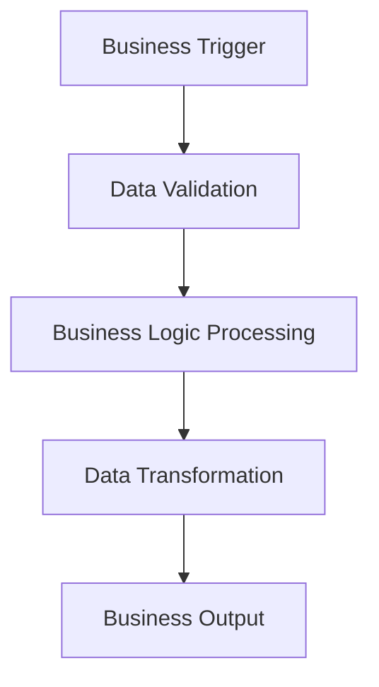
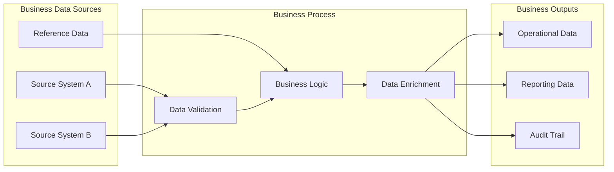
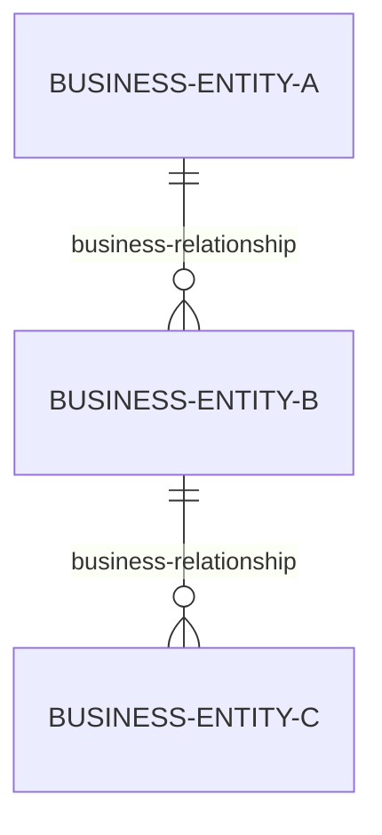

# PHASE 2: Business Analysis - [Procedure Name]

## 📈 BUSINESS INTERPRETATION & STRATEGY PHASE

**STRICT SCOPE**: This template is for **BUSINESS ANALYSIS & STRATEGIC INTERPRETATION**
- ✅ **DO**: Interpret technical data into business insights and requirements
- ❌ **DON'T**: Extract new technical data or modify technical facts
- ✅ **DO**: Create executive summaries, business requirements, strategic recommendations
- ❌ **DON'T**: Change or reanalyze technical implementation details

**MANDATORY PREREQUISITE**: Technical Analysis Phase MUST be completed first
- **Input Required**: Complete `[ProcedureName]-TechnicalAnalysis.md` document
- **Process**: Business interpretation of technical facts
- **Output**: Executive-level strategic analysis and business requirements

**ROLE SEPARATION**:
- **Business Analyst**: Interprets technical data for business meaning
- **Technical Facts**: Come from Phase 1 - DO NOT modify technical findings

---

## 📋 BUSINESS ANALYST RESPONSIBILITIES

**WHAT YOU MUST DO**:
- Interpret technical facts into business context and meaning
- Create executive summaries from technical evidence
- Reverse-engineer business requirements from code behavior
- Develop strategic recommendations based on technical capabilities
- Generate business process flows and visual architecture diagrams
- Assess business value, risks, and optimization opportunities

**WHAT YOU MUST NOT DO**:
- Extract new technical data from database (use Phase 1 data only)
- Modify or reinterpret technical facts from Phase 1
- Make assumptions not supported by technical evidence
- Create technical specifications or implementation details
- Duplicate technical analysis from Phase 1

**SUCCESS CRITERIA**:
- Business insights grounded in technical evidence from Phase 1
- Executive summary suitable for leadership presentation
- Business requirements traceable to technical implementation
- Strategic recommendations with clear business value

---

## 📊 DOCUMENT METADATA

**Procedure Name**: [From Technical Analysis document]
**Business Domain**: [Identify business area/domain from technical evidence]
**Analysis Date**: [Current date]
**Business Analyst**: [Your name/role]
**Technical Analysis Source**: `[ProcedureName]-TechnicalAnalysis.md` (Phase 1)
**Template Version**: 1.0.0
**Phase**: Business Analysis & Strategy (Phase 2 of 2)
**Dependencies**: Technical Analysis must be complete and validated

---

## 1️⃣ EXECUTIVE SUMMARY (Business Leadership Perspective)

### Business Purpose Analysis
*[Interpret technical implementation from Phase 1 to identify business problem solved]*
**Source**: Reference technical code behavior from `[ProcedureName]-TechnicalAnalysis.md`

**Business Capabilities Delivered**:
- [Translate technical functions into business capabilities]
- [Identify business processes enabled by technical implementation]
- [Determine business value proposition from technical evidence]

### Strategic Business Importance
*[Analyze business criticality based on technical dependencies from Phase 1]*

**Business Impact Assessment**:
- **Operational Criticality**: [High/Medium/Low - derived from technical dependency analysis]
- **Data Volume Impact**: [Business significance - derived from technical table analysis]
- **User Community Affected**: [Business scope - derived from technical calling procedures]
- **Business Continuity Risk**: [Risk level - derived from technical error handling analysis]

### Performance Business Impact
*[Translate technical performance characteristics into business terms]*

**Business Performance Implications**:
- **Processing Efficiency**: [Business impact derived from technical execution analysis]
- **Data Quality Assurance**: [Business reliability derived from technical validation logic]
- **Scalability Capacity**: [Growth potential derived from technical design constraints]
- **Resource Optimization**: [Cost efficiency derived from technical resource usage]

---

## 2. Business Process Flow

### High-Level Business Process


### Business Process Steps
*[Extract business steps from technical implementation]*

| Step | Business Activity | Business Rule | Data Input | Data Output |
|------|-------------------|---------------|------------|-------------|
| 1 | [Translate technical step to business activity] | [Extract business rule from code logic] | [Business data source] | [Business data result] |
| 2 | [Continue for each major business step] | | | |

### Business Decision Points
*[Identify business logic from technical branching and conditions]*

| Decision Point | Business Criteria | Business Impact | Technical Implementation |
|----------------|-------------------|-----------------|--------------------------|
| [Extract decision logic from code conditions] | | | |

---

## 3. Business Requirements Analysis

### Reverse-Engineered Business Requirements
*[Derive business requirements from technical implementation patterns]*

#### BR-001: [Primary Business Requirement]
**Business Need**: [What business need does this requirement address?]
**Technical Evidence**: [Reference specific code sections from TechAnalysis]
**Business Rule**: [Extract business rule from implementation]
**Compliance Impact**: [Any regulatory or compliance implications]

#### BR-002: [Data Quality Requirement]
**Business Need**: [Data quality/validation requirement]
**Technical Evidence**: [Reference validation logic from TechAnalysis]
**Business Rule**: [Data quality standards enforced]
**Compliance Impact**: [Data governance implications]

#### BR-003: [Performance Requirement]
**Business Need**: [Performance/efficiency requirement]
**Technical Evidence**: [Reference performance characteristics from TechAnalysis]
**Business Rule**: [SLA or performance standards]
**Compliance Impact**: [Operational requirements]

#### BR-004: [Security Requirement]
**Business Need**: [Security/access control requirement]
**Technical Evidence**: [Reference security analysis from TechAnalysis]
**Business Rule**: [Access control or data protection rules]
**Compliance Impact**: [Security compliance requirements]

#### BR-005: [Integration Requirement]
**Business Need**: [System integration requirement]
**Technical Evidence**: [Reference dependency analysis from TechAnalysis]
**Business Rule**: [Data exchange or system coordination rules]
**Compliance Impact**: [Integration standards]

*[Continue adding requirements based on technical analysis findings]*

### Business Rule Validation
*[Cross-reference technical implementation with business requirements]*

| Business Rule | Technical Implementation | Validation Status | Gaps Identified |
|---------------|--------------------------|-------------------|-----------------|
| [Map each business rule to technical code] | | | |

---

## 4. Data Architecture Analysis

### Business Data Flow


### Business Entity Relationships
*[Translate technical table relationships to business entity model]*



### Data Governance Assessment
*[Analyze data handling from business perspective]*

| Business Data Element | Source Authority | Quality Controls | Retention Requirements | Privacy Considerations |
|----------------------|------------------|------------------|----------------------|------------------------|
| [Translate technical columns to business data elements] | | | | |

---

## 5. Business Risk Analysis

### Operational Risk Assessment
*[Translate technical risks to business impact]*

| Risk Category | Business Impact | Probability | Mitigation Strategy | Technical Evidence |
|---------------|-----------------|-------------|---------------------|-------------------|
| **Data Quality Risk** | [Business impact of data errors] | [Based on error handling] | [Current controls] | [Reference TechAnalysis] |
| **Performance Risk** | [Business impact of slow processing] | [Based on complexity] | [Current optimizations] | [Reference TechAnalysis] |
| **Integration Risk** | [Business impact of dependency failures] | [Based on dependencies] | [Current error handling] | [Reference TechAnalysis] |
| **Security Risk** | [Business impact of data breaches] | [Based on security analysis] | [Current controls] | [Reference TechAnalysis] |

### Business Continuity Assessment
*[Analyze business impact of technical failures]*

**Failure Impact Analysis**:
- **Revenue Impact**: [Estimated business cost of procedure failure]
- **Customer Impact**: [Effect on customer experience/service]
- **Compliance Impact**: [Regulatory or audit implications]
- **Operational Impact**: [Effect on business operations]

### Change Risk Assessment
*[Analyze business risk of modifying this procedure]*

**Modification Risk Matrix**:
| Change Type | Business Risk Level | Impact Scope | Testing Requirements | Approval Authority |
|-------------|-------------------|--------------|---------------------|-------------------|
| **Minor Enhancement** | [Low/Medium/High] | [Affected business areas] | [Required testing] | [Who must approve] |
| **Major Modification** | [Low/Medium/High] | [Affected business areas] | [Required testing] | [Who must approve] |
| **Replacement** | [Low/Medium/High] | [Affected business areas] | [Required testing] | [Who must approve] |

---

## 6. Business Value Assessment

### Current Business Value
*[Quantify business value delivered by current implementation]*

**Value Metrics**:
- **Process Efficiency**: [Time/cost savings delivered]
- **Data Quality Improvement**: [Accuracy/consistency benefits]
- **Automation Value**: [Manual process elimination]
- **Compliance Value**: [Risk reduction/audit benefits]

### Optimization Opportunities
*[Identify business improvement opportunities from technical analysis]*

| Opportunity Area | Business Benefit | Technical Change Required | Investment Level | ROI Estimate |
|------------------|------------------|---------------------------|-----------------|--------------|
| [Performance Optimization] | [Faster business processes] | [Technical improvements needed] | [Low/Medium/High] | [Estimated return] |
| [Data Quality Enhancement] | [Better business decisions] | [Technical improvements needed] | [Low/Medium/High] | [Estimated return] |
| [Process Automation] | [Reduced manual effort] | [Technical improvements needed] | [Low/Medium/High] | [Estimated return] |

---

## 7. Strategic Recommendations

### Short-Term Recommendations (0-6 months)
*[Based on technical analysis findings]*

#### Recommendation 1: [Priority Fix/Enhancement]
**Business Justification**: [Why this is important for business]
**Technical Implementation**: [Reference specific technical changes needed]
**Expected Business Outcome**: [Measurable business benefit]
**Investment Required**: [Effort/cost estimate]
**Risk Level**: [Implementation risk assessment]

#### Recommendation 2: [Performance Improvement]
**Business Justification**: [Business case for performance improvement]
**Technical Implementation**: [Specific technical optimizations]
**Expected Business Outcome**: [Performance benefits in business terms]
**Investment Required**: [Effort/cost estimate]
**Risk Level**: [Implementation risk assessment]

### Medium-Term Recommendations (6-18 months)
*[Strategic improvements based on technical architecture]*

#### Recommendation 3: [Architectural Enhancement]
**Business Justification**: [Strategic business value]
**Technical Implementation**: [Major technical changes required]
**Expected Business Outcome**: [Long-term business benefits]
**Investment Required**: [Significant effort/cost estimate]
**Risk Level**: [Higher risk assessment]

### Long-Term Strategic Vision (18+ months)
*[Future state recommendations]*

#### Recommendation 4: [Strategic Transformation]
**Business Justification**: [Strategic business transformation]
**Technical Implementation**: [Major architectural changes]
**Expected Business Outcome**: [Transformational business benefits]
**Investment Required**: [Major investment estimate]
**Risk Level**: [Transformation risk assessment]

---

## 8. Business Requirements Roadmap

### Implementation Priority Matrix
```mermaid
quadrant-chart
    title Business Value vs Implementation Effort
    x-axis Low Effort --> High Effort
    y-axis Low Value --> High Value
    quadrant-1 Quick Wins
    quadrant-2 Major Initiatives
    quadrant-3 Fill-ins
    quadrant-4 Questionable

    %% Plot recommendations based on effort vs value analysis
```

### Business Milestone Planning
| Phase | Timeline | Business Outcome | Success Criteria | Dependencies |
|-------|----------|------------------|------------------|--------------|
| **Phase 1: Stabilization** | [0-6 months] | [Critical fixes/improvements] | [Measurable criteria] | [Prerequisites] |
| **Phase 2: Optimization** | [6-12 months] | [Performance/efficiency gains] | [Measurable criteria] | [Prerequisites] |
| **Phase 3: Enhancement** | [12-18 months] | [New capabilities] | [Measurable criteria] | [Prerequisites] |
| **Phase 4: Transformation** | [18+ months] | [Strategic transformation] | [Measurable criteria] | [Prerequisites] |

---

## 9. Success Metrics and KPIs

### Business Performance Indicators
*[Define measurable business success metrics]*

| KPI Category | Metric | Current Baseline | Target Value | Measurement Method |
|--------------|--------|------------------|--------------|-------------------|
| **Operational Efficiency** | [Processing time/cost] | [From technical analysis] | [Improvement target] | [How to measure] |
| **Data Quality** | [Accuracy/completeness] | [From technical analysis] | [Quality target] | [How to measure] |
| **User Satisfaction** | [User experience metrics] | [Current state] | [Satisfaction target] | [How to measure] |
| **Business Value** | [ROI/cost savings] | [Current value] | [Value target] | [How to measure] |

### Monitoring and Reporting Strategy
*[Define ongoing business monitoring approach]*

**Regular Business Reviews**:
- **Weekly Operational Review**: [Key operational metrics]
- **Monthly Performance Review**: [Business performance analysis]
- **Quarterly Strategic Review**: [Strategic goal assessment]
- **Annual Business Case Review**: [ROI and value assessment]

---

## 10. Stakeholder Communication Plan

### Executive Summary for Leadership
*[High-level business summary for executives]*

**Key Messages**:
- **Current Business State**: [One-sentence summary of current capability]
- **Strategic Importance**: [Why this matters to business strategy]
- **Optimization Opportunity**: [Key improvement potential]
- **Investment Recommendation**: [Recommended action and investment]
- **Expected ROI**: [Return on investment projection]

### Technical Team Briefing
*[Business context for technical implementation teams]*

**Business Context for Developers**:
- **Business Process Supported**: [What business process this enables]
- **Business Rules to Maintain**: [Critical business logic that must be preserved]
- **Business Impact of Changes**: [How technical changes affect business]
- **Business Success Criteria**: [How business will measure success]

### Business User Communication
*[Information for business process owners and users]*

**Business User Guide**:
- **Process Overview**: [How this affects daily business operations]
- **Quality Expectations**: [What level of service to expect]
- **Escalation Procedures**: [Who to contact for business issues]
- **Future Enhancements**: [Planned improvements and timeline]

---

## ✅ BUSINESS ANALYSIS COMPLETION CHECKLIST

**Phase 2 Business Interpretation Validation**:
- [ ] Technical Analysis document (`[ProcedureName]-TechnicalAnalysis.md`) thoroughly reviewed
- [ ] Business purpose clearly identified from technical evidence
- [ ] Business process flow accurately derived from technical implementation
- [ ] Business requirements reverse-engineered from actual code behavior
- [ ] Executive summary created with quantified business metrics
- [ ] Strategic recommendations grounded in technical capabilities
- [ ] Business value assessment completed with ROI projections
- [ ] Risk analysis addresses business continuity and operational impact

**Business Communication Materials**:
- [ ] Executive summary suitable for C-level presentation
- [ ] Business requirements specification ready for stakeholders
- [ ] Technical briefing provides business context for development teams
- [ ] Business user documentation addresses operational concerns
- [ ] Strategic roadmap provides clear implementation guidance

**Quality Assurance - Business Interpretation**:
- [ ] All business analysis traceable to technical evidence from Phase 1
- [ ] No technical facts modified or reinterpreted from Phase 1
- [ ] No assumptions made without technical validation from Phase 1
- [ ] Business recommendations aligned with technical feasibility
- [ ] Success metrics are measurable and achievable
- [ ] Document ready for executive and stakeholder review

---

## 🎯 BUSINESS ANALYSIS DELIVERABLES

**PRIMARY DELIVERABLE** ✅
- **Save this document as**: `[ProcedureName]-BusinessAnalysis.md`
- **Status**: Complete Business Analysis (Phase 2 Complete)
- **Audience**: Executives, Business Stakeholders, Strategic Planning

**SUPPORTING DELIVERABLES** (Generated from this analysis):
- Executive presentation slides (optional)
- Business requirements specification (derived)
- Implementation roadmap (derived)
- Business case documentation (derived)

**DOCUMENT RELATIONSHIPS**:
- **Phase 1 Input**: `[ProcedureName]-TechnicalAnalysis.md` (technical facts)
- **Phase 2 Output**: `[ProcedureName]-BusinessAnalysis.md` (business interpretation)
- **Combined Value**: Complete understanding from technical to strategic

---

## 🔒 CRITICAL ANALYSIS INTEGRITY

**SEPARATION OF DUTIES MAINTAINED**:
✅ **Technical Facts**: Preserved from Phase 1 without modification
✅ **Business Interpretation**: Added in Phase 2 based on technical evidence
✅ **Strategic Recommendations**: Grounded in technical capabilities
✅ **Executive Summary**: Synthesized from complete technical analysis

**AUDIT TRAIL**:
- All business interpretations reference specific technical evidence
- No technical modifications made during business analysis
- Business requirements traceable to actual code behavior
- Strategic recommendations supported by technical feasibility

---

**🏁 END OF TWO-PHASE ANALYSIS**
*Complete stored procedure analysis: Technical facts + Business strategy*
