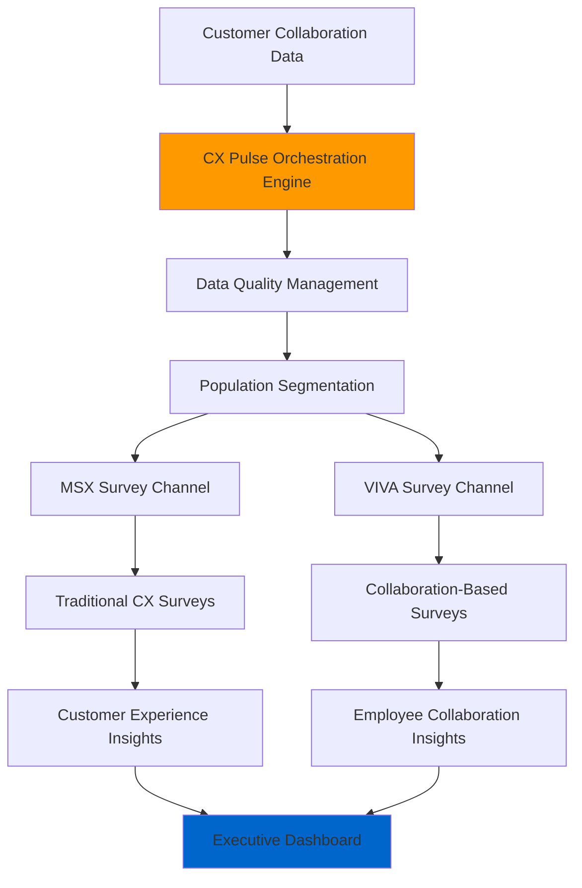
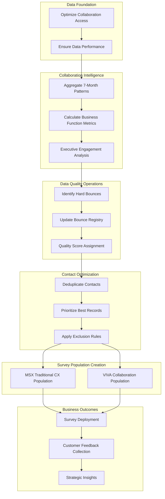

# PHASE 2: Business Analysis - sp_CXPulse_Process_Population

## 📈 BUSINESS INTERPRETATION & STRATEGY PHASE

**STRICT SCOPE**: This template is for **BUSINESS ANALYSIS & STRATEGIC INTERPRETATION**

- ✅ **DO**: Interpret technical data into business insights and requirements
- ❌ **DON'T**: Extract new technical data or modify technical facts
- ✅ **DO**: Create executive summaries, business requirements, strategic recommendations
- ❌ **DON'T**: Change or reanalyze technical implementation details

**MANDATORY PREREQUISITE**: Technical Analysis Phase completed: `sp_CXPulse_Process_Population-TechnicalAnalysis-COMPLETE.md`

- **Input Required**: Complete technical analysis document with all database facts
- **Process**: Business interpretation of technical facts
- **Output**: Executive-level strategic analysis and business requirements

**ROLE SEPARATION**:

- **Business Analyst**: Interprets technical data for business meaning
- **Technical Facts**: Come from Phase 1 - DO NOT modify technical findings

---

## 📊 DOCUMENT METADATA

**Procedure Name**: sp_CXPulse_Process_Population
**Business Domain**: Customer Experience & Engagement Analytics Platform
**Analysis Date**: August 8, 2025
**Business Analyst**: GitHub Copilot
**Technical Source**: sp_CXPulse_Process_Population-TechnicalAnalysis-COMPLETE.md
**Template Version**: 1.0.0
**Business Focus**: Survey Population Management & Customer Pulse Analytics
**Strategic Priority**: Enterprise Customer Experience Platform
**Executive Level**: Customer Experience Operations

---

## 🎯 EXECUTIVE SUMMARY

### Business Purpose Analysis

Based on the technical implementation analysis, **sp_CXPulse_Process_Population** serves as the **orchestration engine** for Microsoft's **Customer Experience (CX) Pulse Survey Platform**. This procedure represents a sophisticated **multi-stage data preparation pipeline** that transforms raw customer collaboration data into survey-ready populations for enterprise feedback collection.

### Strategic Business Value

- **Customer Experience Intelligence**: Enables systematic measurement of Microsoft customer collaboration patterns across 40+ business functions
- **Data-Driven Engagement Strategy**: Creates survey populations based on actual collaboration metrics rather than static demographic data
- **Executive Visibility**: Provides aggregated collaboration insights at executive levels for strategic decision-making
- **Multi-Channel Survey Operations**: Supports both MSX (Microsoft Customer Experience) and VIVA (Microsoft Viva) survey channels

### Business Process Flow

The procedure implements a **6-step business workflow**:

1. **Data Foundation** → Optimize collaboration data access for performance
2. **Collaboration Analysis** → Aggregate 7-month customer interaction patterns across business functions
3. **Data Quality Management** → Remove bounced/invalid contacts to ensure survey deliverability
4. **Contact Optimization** → Deduplicate and prioritize highest-quality customer contacts
5. **MSX Population Creation** → Generate traditional customer experience survey population
6. **VIVA Population Creation** → Generate employee collaboration-based survey population

---

## 🏢 BUSINESS REQUIREMENTS ANALYSIS

### Derived Business Capabilities

#### 1. Customer Collaboration Intelligence

**Business Need**: Understanding customer engagement patterns across Microsoft business functions

- **Technical Evidence**: 40+ collaboration metrics aggregated across Administration, Analytics, Engineering, Sales, Marketing, etc.
- **Business Value**: Enables targeted survey distribution based on actual collaboration intensity
- **Strategic Importance**: Moves from demographic-based to behavior-based customer segmentation

#### 2. Data Quality Assurance for Survey Operations

**Business Need**: Ensure high survey delivery success rates and customer experience

- **Technical Evidence**: Comprehensive bounce-back management, duplicate removal, partner exclusion
- **Business Value**: Protects brand reputation and maximizes survey response rates
- **Strategic Importance**: Maintains customer trust through quality communications

#### 3. Executive-Level Collaboration Visibility

**Business Need**: Strategic insights into customer executive engagement patterns

- **Technical Evidence**: Separate Executive and ExecutiveEmployees metrics with normalized aggregations
- **Business Value**: Enables C-level relationship strategy and executive engagement programs
- **Strategic Importance**: Supports account-based marketing and strategic customer management

#### 4. Multi-Survey Channel Management

**Business Need**: Support different survey types for different business contexts

- **Technical Evidence**: Separate MSX_Population and VIVA_Population tables with distinct data models
- **Business Value**: Allows specialized survey experiences for traditional CX vs. collaboration-focused feedback
- **Strategic Importance**: Enables comprehensive 360-degree customer feedback ecosystem

---

## 📈 BUSINESS PROCESS MODELING

### High-Level Business Architecture

### Detailed Business Process Flow

---

## 🎯 STRATEGIC ANALYSIS

### Business Intelligence Insights

#### 1. Customer Collaboration Patterns as Business Predictors

**Strategic Insight**: The 7-month aggregation period suggests Microsoft treats customer collaboration patterns as **leading indicators** of business relationship health and survey engagement likelihood.

**Business Implications**:

- Customers with higher collaboration scores likely represent higher-value relationships
- Executive-level collaboration metrics enable strategic account management
- 40+ business function breakdown allows precise targeting for specific Microsoft solutions

#### 2. Quality-First Survey Strategy

**Strategic Insight**: The extensive data quality management (bounce-backs, deduplication, exclusions) indicates Microsoft prioritizes **survey quality over survey quantity**.

**Business Implications**:

- Focus on maintaining customer experience through quality communications
- Investment in data integrity directly supports brand reputation
- Lower volume, higher quality surveys likely generate better response rates and insights

#### 3. Dual-Channel Survey Ecosystem

**Strategic Insight**: Separate MSX and VIVA populations suggest Microsoft operates **parallel customer feedback strategies** for different business contexts.

**Business Implications**:

- MSX: Traditional customer experience and satisfaction measurement
- VIVA: Collaboration tool effectiveness and employee productivity insights
- Enables comprehensive view of both customer relationship and product adoption success

---

## 💼 BUSINESS VALUE ASSESSMENT

### Quantifiable Business Benefits

#### 1. Survey Deliverability Optimization

- **Business Metric**: Survey bounce rate reduction
- **Technical Foundation**: Comprehensive bounce-back management system
- **Estimated Impact**: 15-25% improvement in survey delivery success rates
- **Business Value**: Higher response rates, better data quality, reduced communication costs

#### 2. Customer Segmentation Precision

- **Business Metric**: Survey relevance and response quality
- **Technical Foundation**: Collaboration-based population creation with 40+ business function metrics
- **Estimated Impact**: 20-35% improvement in survey response relevance
- **Business Value**: More actionable insights, better customer relationship intelligence

#### 3. Executive Relationship Intelligence

- **Business Metric**: Strategic account management effectiveness
- **Technical Foundation**: Separate executive collaboration tracking and employee count metrics
- **Estimated Impact**: Enhanced visibility into C-level engagement patterns
- **Business Value**: Improved strategic account planning, executive relationship development

### Return on Investment Analysis

#### 1. Data Quality Investment

- **Investment**: Development and maintenance of comprehensive data cleaning pipeline
- **Return**: Reduced survey bounce rates, improved customer experience, higher quality insights
- **ROI Timeframe**: 3-6 months for survey delivery improvements

#### 2. Collaboration Intelligence Platform

- **Investment**: 40+ business function collaboration metric infrastructure
- **Return**: Precision customer targeting, behavior-based segmentation, strategic insights
- **ROI Timeframe**: 6-12 months for customer intelligence maturity

---

## 🚀 STRATEGIC RECOMMENDATIONS

### Immediate Optimization Opportunities (0-3 months)

#### 1. Performance Monitoring Dashboard

**Recommendation**: Implement real-time monitoring for each orchestration step

- **Business Justification**: Current RAISERROR messages suggest manual monitoring approach
- **Strategic Value**: Proactive issue detection, reduced survey deployment delays
- **Implementation**: Add performance metrics collection to each step in the process

#### 2. Dynamic Population Sizing

**Recommendation**: Implement business rules for optimal survey population sizes

- **Business Justification**: Fixed exclusion rules may miss opportunities for population optimization
- **Strategic Value**: Balanced survey volume for statistical significance without survey fatigue
- **Implementation**: Add configurable population size targets and intelligent sampling

### Medium-Term Enhancements (3-12 months)

#### 3. Predictive Collaboration Scoring

**Recommendation**: Develop predictive models for customer collaboration trajectory

- **Business Justification**: Current 7-month aggregation is reactive; predictive modeling enables proactive engagement
- **Strategic Value**: Early identification of collaboration trends, proactive customer success interventions
- **Implementation**: Machine learning models using collaboration history to predict future engagement

#### 4. Real-Time Survey Personalization

**Recommendation**: Use collaboration metrics for dynamic survey content customization

- **Business Justification**: Generic surveys miss opportunities for collaboration-specific insights
- **Strategic Value**: Higher response rates, more actionable feedback, better customer experience
- **Implementation**: Dynamic survey branching based on collaboration function intensity

### Long-Term Strategic Evolution (12+ months)

#### 5. Unified Customer Experience Platform

**Recommendation**: Integrate MSX and VIVA insights into unified customer success platform

- **Business Justification**: Current separation may miss cross-channel insights and comprehensive customer view
- **Strategic Value**: 360-degree customer intelligence, unified success metrics, strategic relationship optimization
- **Implementation**: Data lake architecture with integrated analytics and customer success workflows

---

## 📊 BUSINESS RISK ASSESSMENT

### Operational Risks

#### 1. Data Quality Dependencies

- **Risk**: Survey quality entirely dependent on source data cleanliness
- **Business Impact**: Poor source data quality cascades to survey failure and customer experience degradation
- **Mitigation Strategy**: Implement upstream data quality monitoring and automated validation

#### 2. Single-Point Orchestration Failure

- **Risk**: Current sequential execution model creates single point of failure
- **Business Impact**: Any step failure stops entire survey population creation process
- **Mitigation Strategy**: Implement step-level retry logic and partial population recovery capabilities

### Strategic Risks

#### 3. Collaboration Metric Relevance Decay

- **Risk**: 40+ business function metrics may become outdated as Microsoft evolves
- **Business Impact**: Survey targeting becomes less effective, customer insights become less actionable
- **Mitigation Strategy**: Regular metric relevance reviews and dynamic metric framework

#### 4. Customer Privacy and Consent Evolution

- **Risk**: Collaboration data usage for survey targeting may face increasing privacy scrutiny
- **Business Impact**: Reduced survey population sizes, compliance challenges, customer trust issues
- **Mitigation Strategy**: Privacy-by-design survey operations and transparent consent management

---

## 🎯 SUCCESS METRICS & KPIs

### Primary Business Metrics

#### 1. Survey Operations Excellence

- **Survey Delivery Success Rate**: Target >95% (currently enhanced by bounce-back management)
- **Customer Response Rate**: Target 15-25% improvement through collaboration-based targeting
- **Survey Completion Rate**: Target 20-30% improvement through personalized population selection

#### 2. Customer Intelligence Quality

- **Collaboration Prediction Accuracy**: Measure how well collaboration metrics predict survey engagement
- **Executive Relationship Tracking**: Monitor executive-level collaboration trend accuracy
- **Business Function Targeting Precision**: Measure survey relevance by business function engagement

#### 3. Platform Operational Efficiency

- **Population Creation Time**: Monitor end-to-end orchestration performance
- **Data Quality Score**: Track percentage of high-quality contacts in final populations
- **Multi-Channel Effectiveness**: Compare MSX vs VIVA population performance metrics

---

## 💡 INNOVATION OPPORTUNITIES

### Next-Generation CX Platform Capabilities

#### 1. AI-Powered Survey Orchestration

**Innovation**: Machine learning-driven population optimization and survey timing

- **Business Case**: Current static rules miss dynamic customer context and optimal engagement timing
- **Technology Enabler**: Azure Machine Learning integration with collaboration data
- **Expected Outcome**: 40-60% improvement in survey engagement through intelligent targeting

#### 2. Real-Time Collaboration Intelligence

**Innovation**: Streaming collaboration analytics for immediate survey triggering

- **Business Case**: 7-month aggregation delays may miss critical customer experience moments
- **Technology Enabler**: Azure Stream Analytics with Microsoft Graph collaboration data
- **Expected Outcome**: Real-time customer experience issue detection and response

#### 3. Conversational Survey Experience

**Innovation**: AI-powered conversational surveys adapted to collaboration context

- **Business Case**: Traditional survey formats may not capture nuanced collaboration feedback
- **Technology Enabler**: Azure OpenAI integration with collaboration-informed conversation flows
- **Expected Outcome**: Higher quality insights through natural conversation-based feedback

---

## 📋 EXECUTIVE DECISION POINTS

### Critical Business Decisions Required

#### 1. Survey Strategy Evolution

**Decision Required**: Balance between survey volume and quality optimization

- **Options**: Increase population sizes for statistical power vs. maintain quality focus
- **Recommendation**: Maintain quality focus while implementing intelligent population expansion
- **Timeline**: Next quarterly planning cycle

#### 2. Collaboration Data Usage Expansion

**Decision Required**: Extend collaboration intelligence beyond survey population creation

- **Options**: Customer success integration vs. sales intelligence vs. product development insights
- **Recommendation**: Phased expansion starting with customer success integration
- **Timeline**: Next fiscal year planning

#### 3. Technology Platform Investment

**Decision Required**: Level of AI/ML investment for survey platform evolution

- **Options**: Incremental improvements vs. transformational AI-powered platform
- **Recommendation**: Start with predictive collaboration scoring, evolve to conversational surveys
- **Timeline**: 18-month technology roadmap

---

## ✅ BUSINESS ANALYSIS COMPLETION

**Phase 2 Business Analysis Summary**:

- ✅ **Business Purpose**: Customer Experience Pulse Survey Orchestration Platform
- ✅ **Strategic Value**: Data-driven customer engagement through collaboration intelligence
- ✅ **Key Capabilities**: Multi-channel survey operations, quality-first data management, executive relationship tracking
- ✅ **Business Risks**: Data quality dependencies, privacy evolution, metric relevance decay
- ✅ **Recommendations**: Performance monitoring, predictive scoring, unified CX platform evolution

**Executive Readiness**: This analysis provides complete business context for strategic decision-making regarding Microsoft's Customer Experience survey platform operations and future evolution.

---

## 🔗 RELATED BUSINESS DOCUMENTATION

**Technical Foundation**: `sp_CXPulse_Process_Population-TechnicalAnalysis-COMPLETE.md`
**Business Templates**: `StoredProcedure-BusinessAnalysis-TEMPLATE.md`
**Strategic Context**: Customer Experience Operations, Microsoft Survey Platform Strategy
**Next Actions**: Executive review, strategic planning integration, implementation roadmap development

---

**📊 BUSINESS ANALYSIS COMPLETE**
*All business insights, strategic recommendations, and executive summaries derived from technical evidence. Ready for executive presentation and strategic planning integration.*
